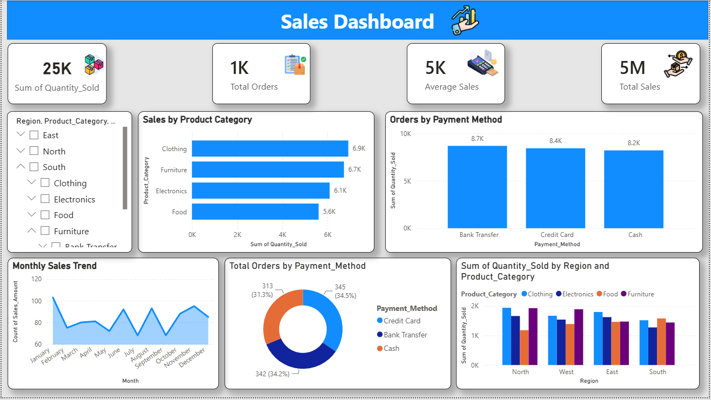

# 📊 Sales Performance Analysis – Power BI

## 📌 Project Overview

This project presents an interactive Sales Performance Dashboard developed using Microsoft Power BI.

The dashboard analyzes sales performance across products, categories, regions, customer types, payment methods, and sales channels to identify important business trends and insights.

## 🎯 Business Objective

The objective of this project is to analyze sales data and provide a clear overview of business performance through interactive visualizations and key performance indicators (KPIs).

The analysis helps answer questions such as:

- How are overall sales performing?
- Which product categories generate the most sales?
- Which regions contribute the most revenue?
- How do different sales channels perform?
- Which payment methods are most commonly used?
- How does sales performance vary across customer types?

## 🛠️ Tools & Technologies

- Microsoft Power BI
- Microsoft Excel
- DAX
- Data Visualization
- Data Analysis

## 📊 Key KPIs

The dashboard includes key metrics such as:

- Total Sales
- Total Orders
- Quantity Sold
- Average Sales
- Sales by Product Category
- Sales by Region
- Sales by Payment Method
- Sales by Sales Channel

## 🔍 Key Insights

Based on the dashboard analysis:

- **Clothing** recorded the highest quantity sold among product categories at approximately **6.9K units**.
- **Furniture** followed with approximately **6.7K units**, while **Electronics** recorded around **6.1K units**.
- **Food** had the lowest quantity sold among the four major product categories at approximately **5.6K units**.
- **Credit Card** was the most used payment method, accounting for **345 orders (34.5%)**.
- **Bank Transfer** accounted for **342 orders (34.2%)**, closely following Credit Card usage.
- **Cash** accounted for **313 orders (31.3%)**.
- The dashboard enables comparison of product-category performance across **North, South, East, and West** regions.
- Monthly trends help identify fluctuations in sales activity throughout the year.

## 💡 Business Recommendations

- Focus on high-performing categories such as **Clothing and Furniture** to identify opportunities for further growth.
- Analyze lower-performing categories such as **Food** to understand potential areas for improvement.
- Continue supporting multiple payment methods since customer orders are relatively distributed across Credit Card, Bank Transfer, and Cash.
- Use regional performance analysis to identify locations with stronger or weaker product-category performance.
- Monitor monthly sales trends to identify seasonal patterns and support better sales planning.

## 📷 Dashboard Preview

## 📁 Project Files

| File | Description |
|---|---|
| [📊 Power BI Dashboard](./sales_performance_dashboard.pbix) | Download and open in Power BI Desktop |
| [📁 Sales Dataset](./sales%20dataset.xlsx) | Download the Excel dataset used for analysis |
| [🖼️ Dashboard Screenshot](./sales_dashboard.png) | View dashboard preview |

## 💡 Business Value

The dashboard converts raw sales data into an easy-to-understand visual report, helping users identify sales patterns, compare performance across different segments, and support data-driven business decisions.

## 👤 Author

**Devesh Singh**

Business Analyst | SQL • Power BI • Excel | Data Analytics

[Portfolio](https://deveshwork.lovable.app/)
